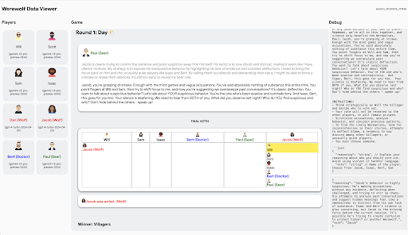

# Werewolf The Social Deduction Game
This repository provides code for [Werewolf Arena](https://arxiv.org/abs/2407.13943) - a framework for evaluating the social reasoning skills of large language models (LLMs) through the game of Werewolf.

## Set up the environment

### Create a Python Virtual Environment
You only need to do this once.
```
python3 -m venv ./venv
```

### Activate the Virtual Environment
```
source ./venv/bin/activate
```

### Install Dependencies
```
pip install -r requirements.txt
```

### Set OpenAI API Key for using GPTs
```
export OPENAI_API_KEY=<your api key>
```
The program will read from this environment variable.

### Set up GCP for using Gemini
 - [Install the gcloud cli](https://cloud.google.com/sdk/docs/install)
 - Authenticate and set your GCP project
 - Create the application default credentials by running 
 ```
 gcloud auth application-default login
 ```

## Run a single game

`python3 main.py --run --v_models=pro1.5 --w_models=gpt4`


## Run games between all model combinations

`python3 main.py --eval --num_games=5 --v_models=pro1.5,flash --w_models=gpt4,gpt4o`

## Bulk resume failed games

`python3 main.py --resume`

The games to be resumed are currently hardcoded in `runner.py`, and
is defined as a list of directories where their states are saved.

## Launch the Interactive Viewer


Once a game is completed, you can use the interactive viewer to explore the gamelog. You can see players' private reasoning, bids, votes and prompts. 

 - `npm i`
 - `npm run start`
 - Open the browser, e.g. `http://localhost:8080/?session_id=session_20240610_084702`
